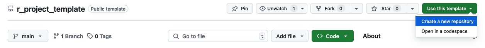

<!--

-->

# R Project Template

> [!IMPORTANT]
> This has been developed for **internal use within the ABMI Science Centre**.
>
> The purpose of these guidelines is to promote consistency and reproducibility across Science Centre projects, making collaboration and review easier. That said, every project is unique. If you adjust the
> structure, please note the changes and your reasoning so they’re clear to others.

Here is an R Project template for storing your project's data, code, and output files within a well-structured directory. While this template is designed for R projects, projects in other programming environments should maintain a similar directory structure. For more information on structuring project directories and best practices for writing reproducible code, see [https://github.com/ABbiodiversity/code_standards](https://github.com/ABbiodiversity/code_standards).

---

## Directory Map

| **Item**                 | **Description**                                   |
| ------------------------ | ------------------------------------------------- |
| **0_data/**              | Raw and manipulated data  [^1]                   |
| ├── external/            | Raw data from external sources                   |
| ├── processed/           | Data that has been manipulated                  |
| **1_code/**              | Code and scripts for analysis                    |
| ├── GEE/                 | Google Earth Engine scripts                      |
| │   └── gee_git_clone.sh | Script to clone GEE repository                   |
| ├── r_scripts/           | R scripts for data processing                    |
| │   └── r_module.R       | Template R script                                |
| │   └── r_function.R     | Template R function                              |
| **2_pipeline/**          | Temporary pipeline files [^1]                    |
| **3_output/**            | Final project output files                              |
| ├── data/                | Processed datasets                               |
| ├── figures/             | Generated figures                                |
| ├── maps/                | Generated maps                                   |
| ├── models/              | Model outputs                                    |
| └── tables/              | Tables from analysis                             |
| **4_writing/**           | Manuscript and reports                           |
| ├── manuscript/          | Drafts of the manuscript                         |
| └── reports/             | Reports and additional documents                 |
| **5_presentations/**     | Presentation materials                           |
| ├── slides/              | Presentation slides (e.g., .pptx)                |
| └── posters/             | Conference posters                               |
| **6_bookdown/**          | Bookdown documentation and project vignette      |
| ├── index.Rmd            | Main Bookdown file (project vignette)           |
| ├── _bookdown.yml        | Bookdown configuration                           |
| └── (additional .Rmd)    | Chapters/sections of the Bookdown documentation  |
| **README.md**            | Project overview and instructions                |

---

## Directory Folder Descriptions 
Below is an overview of the main folders in the project directory:

### 0_data
This folder holds all **raw and manipulated data** used in the project.

- **external/**  
  - **Purpose**: Stores the original, unprocessed (“raw”) data from external sources (e.g., CSV files, shapefiles, remote sensing data).  
  - **Typical contents**: Files downloaded from a public repository, database exports, or any data provided by collaborators.   
  - *Tip*: Keep these files in their original form for reproducibility and to avoid accidental overwriting.

- **processed/**  
  - **Purpose**: Contains “analysis-ready” data—data that have been cleaned, transformed, or pre-processed.  
  - **Typical contents**: CSV, RData, shapefiles, etc. that are ready for direct use by scripts in `1_code/`.
  - *Tip*: Think of this as your “staging ground” for cleaned data that can be loaded quickly by your analysis scripts.

---

### 1_code

- **Purpose**: This folder holds **all code and scripts** for your project—from data cleaning to final analyses.
- **Typical contents**: R, JavaScript, Python files organized and named according to their step in the project workflow.
*Note*: Consider adding subfolders for other languages or script types (e.g., `python_scripts/`, `bash_scripts/`) if needed.

---

### 2_pipeline

- **Purpose**:  
  - Houses **intermediate files** that are not final deliverables but useful for re-running code or debugging. 
- **Typical contents**: checkpoints, logs, temporary files, and partial outputs (e.g., data subsets during model training) to avoid re-generating heavy files from scratch.

*Tip*: Keeping intermediate files here means you don’t clutter the `0_data` or `3_output` folders with temporary files. 

---

### 3_output
Collects the **final (or “permanent”) outputs** of your analyses—whatever you plan to archive, publish, or share broadly. 

- **Purpose**:Stores complete and polished outputs: cleaned datasets, figures, tables, model results, etc.
- **Typical contents**:
  - **data/**: Final data products that might be shared or referenced in publications.
  - **figures/**: High-quality plots and visualizations for reports, papers, or presentations.
  - **maps/**: Geographic products (e.g., shapefiles, GIS layers, static map images).
  - **models/**: Final model objects, predictions, or performance metrics.
  - **tables/**: Summaries or statistical tables ready for publication.

- *Tip*: If you were to share your project’s key results, you’d pull them from here.

---

### 4_writing
Contains all **written materials**—manuscripts, reports, and supporting documents.

- **manuscript/**  
  - **Purpose**: Drafts of the main publication or paper.
  - **Typical contents**: Word docs, LaTeX files, references

- **reports/**  
  - **Purpose**: Additional documents outside the primary manuscript (e.g., progress reports, technical docs, stakeholder summaries).
  - **Typical contents**: PDF or Word documents that serve as “formal communication” to collaborators or funding agencies.

---

### 5_presentations
- **Purpose**: Stores **presentation materials** used to communicate your project’s work.
- **Typical contents**: Slide decks, speaker notes, conference posters.

---

### 6_bookdown 

- **Purpose**: Contains **Bookdown documents**. A dedicated space for creating Bookdown-based documentation, tutorials, or a detailed project vignette. 

- **Typical contents**:
    - `_bookdown.yml` and `index.Rmd` 
    - Chapter .Rmd files: Individual sections of your Bookdown document (e.g., introduction, methodology, results). 
    - A compiled "book" (e.g. PDF or HTML)

---

### README.md
The **“front door”** to your project—an overview and instructions for replication.

  - Explains the project’s goals, scope, and context.  
  - Details how to set up the environment (required libraries, data sources, program languages).  
  - Guides others (and your future self) on how to run the project steps or locate key files.

---

### Putting It All Together

- **0_data**: Raw (`external/`) and analysis-ready (`processed/`) data.  
- **1_code**: Your “toolshed” of scripts in R, Python, GEE, etc.  
- **2_pipeline**: Intermediate files—logs, partial files, checkpoints, etc.
- **3_output**: Final, polished deliverables—data, figures, tables, models.  
- **4_writing**: Manuscripts, reports, and other written documentation.  
- **5_presentations**: Slides, posters, and other public-facing materials.  
- **6_bookdown**: Bookdown documentation for project vignettes, user guides, or tutorials.
- **README.md**: The roadmap for anyone navigating or replicating the project.

---
## Use this Template to Create a New Repository

1. Navigate to the **main page** of the template repository in your browser.
2. Look for the **“Use this template”** button (usually located on the top right side of top GitHub UI bar. 
3. Click **“Use this template”** to open a drop-down menu. Click **"Create a new repository"** and follow the instructions.

Below is a screenshot showing where to click **“Use this template”** on GitHub:

---

[^1]: Data and pipeline files are generally added to `.gitignore` to prevent them from being pushed to GitHub.

